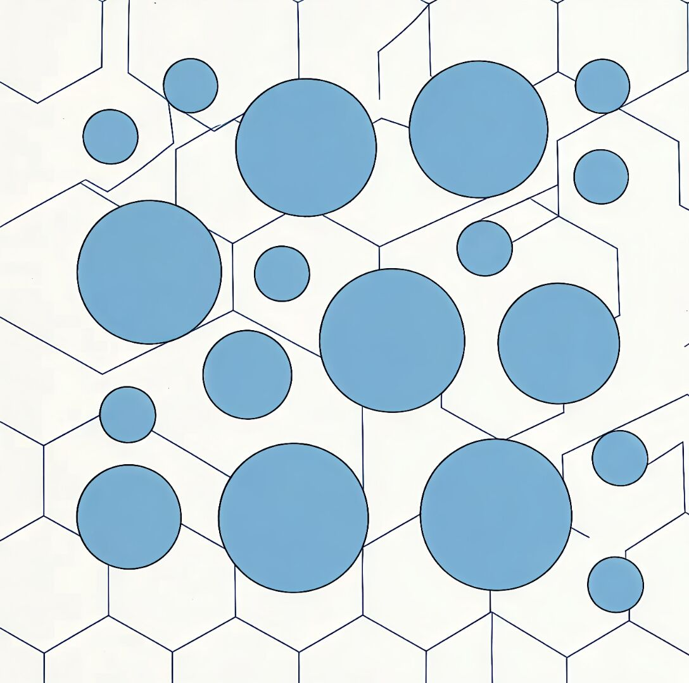
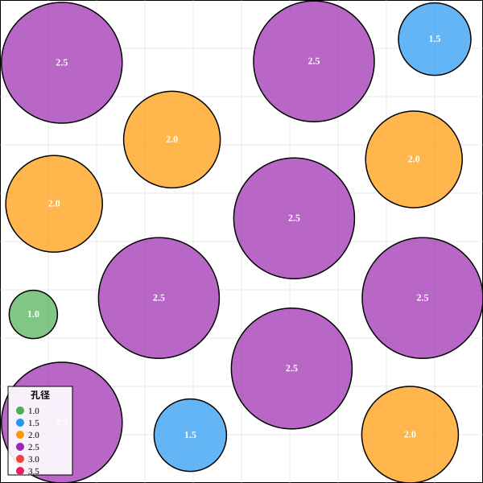
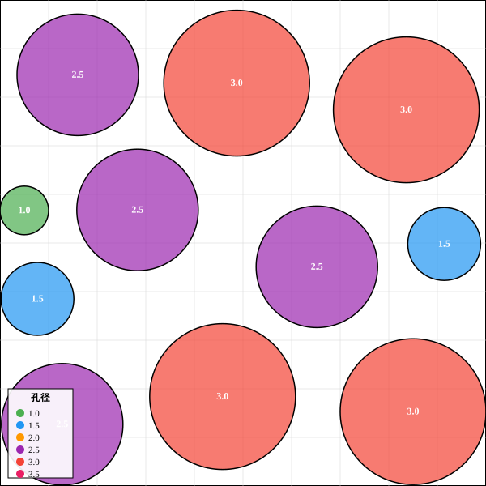
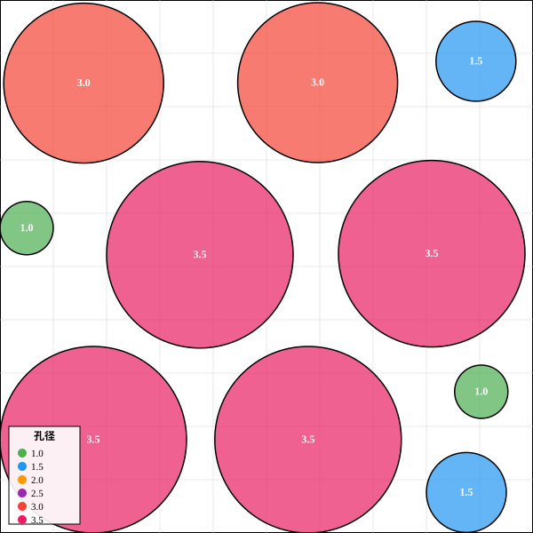
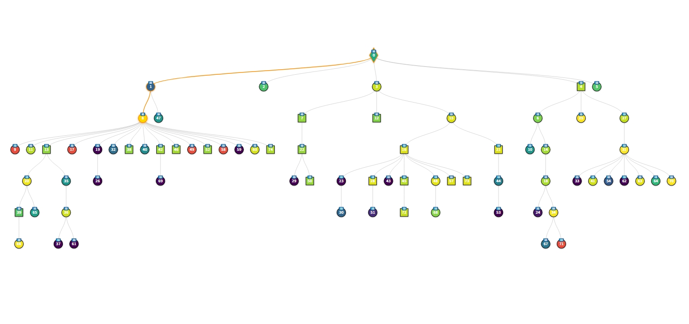
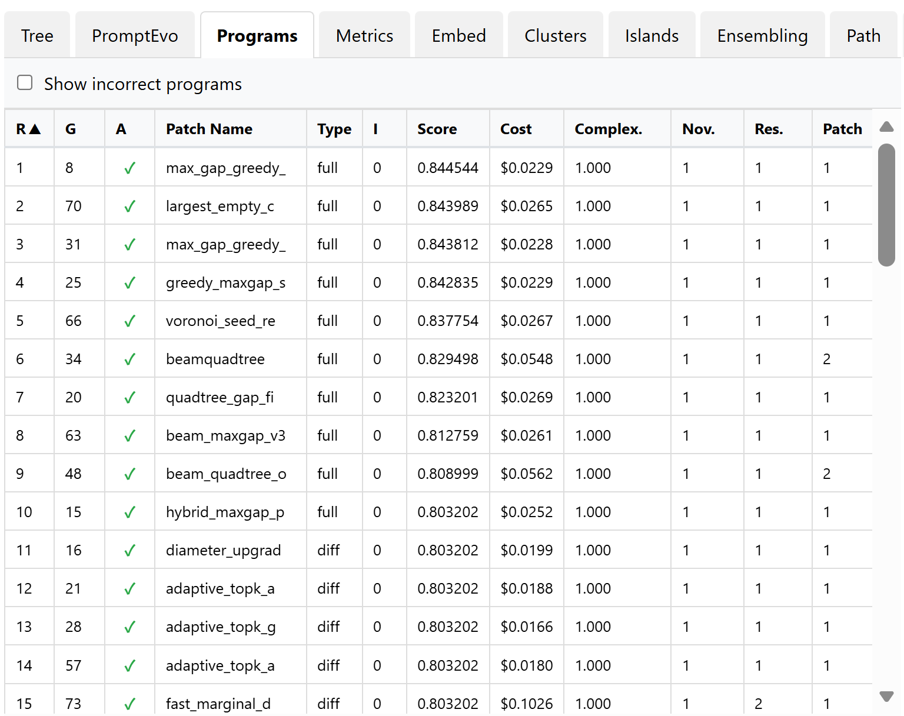
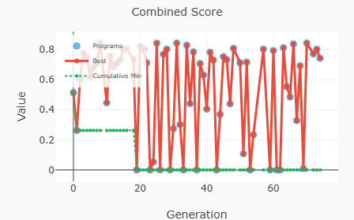

# ShinkaEvolve Nano-Membrane Fork


 **基于大语言模型（LLM）的垂直碳纳米管（VACNT）膜异质孔径排布优化**

本仓库利用 **ShinkaEvolve** 进化算法框架，解决海水淡化 VACNT 膜设计中的核心难题 —— **非等圆圆形打包问题（Non-Equal Circle Packing）**，实现渗透性与截留率的多目标优化。

---

## 💡 核心逻辑

### 物理背景
传统膜分离受"渗透性‑选择性"权衡限制。本项目引入**动态振荡范式**：通过微小机械振荡激活大孔径（3.5 nm）的高通量能力，并与 **1 nm（高选择性）至 3.5 nm（高通量）共 6 种异质孔**协同工作。在此前提下，本代码库负责在安全距离约束下，寻找最大化膜功能利用效率的最优孔径排布方案。

### 两层优化结构

**核心理念**：不是让 AI 直接生成排布坐标，而是让 AI 进化出"生成排布的算法"。

```
🔹 第一层：算法进化 (ShinkaEvolve)
  ├─ 输入：initial.py (初始算法)
  ├─ 过程：LLM 变异 → 评估 → 筛选 → 迭代
  ├─ 输出：best/main.py (最优算法)
  └─ 评价：combined_score (算法的稳健性)
       ↓
🔹 第二层：排布采样
  ├─ 输入：best/main.py
  ├─ 过程：多次运行 (不同 seed / α 值)
  ├─ 输出：多个排布 JSON
  └─ 评价：每个排布的 score (单方案质量)
```

**为什么要两层？**
- **算法空间 ≪ 坐标空间**：直接搜索坐标组合的空间过大，效率极低。
- **LLM 擅长逻辑优化**：更适合理解与改进算法逻辑，而非精确数值优化。
- **一个好算法 → 无数个好排布**：进化出的算法可以生成大量高质量排布供下游选择。

---

## 🎏 为什么选择 ShinkaEvolve 框架？

纳米膜布局是一个带硬约束的多目标优化问题（渗透性 P vs 截留率 R）。传统做法是让 AI 一次性生成求解器代码，缺乏迭代反馈，难以持续改进。ShinkaEvolve 提供了**程序级进化**方案：将算法本身作为可进化的个体，通过 LLM 驱动的变异与真实评估驱动的筛选，自动在算法空间中进行搜索。

### 框架进化机制（以本问题为例）
1. **初始化**：提供一个初始求解器（`initial.py`），其中 `EVOLVE-BLOCK` 标记可编辑区域。
2. **异步进化循环**：
   - **采样**：从数据库中选择父代程序及若干高绩效"灵感"程序。
   - **生成补丁**：LLM 生成 `diff`（局部修改）或 `full`（整体重写）补丁，仅作用于 `EVOLVE-BLOCK`。
   - **评估**：自动运行 5 次（不同 α 权重），计算 Pareto 前沿的超体积与可行率，得到 `combined_score`。
   - **入库与选择**：存储代码、得分、补丁类型、父代关系等，并更新最优快照。
   - **新颖性保护**：通过嵌入相似度 + LLM 判定，避免早熟收敛。
   - **多岛与元学习**（可选）：保持多样性，定期总结成功/失败模式注入后续提示。
3. **停止条件**：达到预设代数（80 代）或累计 API 成本上限（$25.0）。

### 与"直接让 AI 生成代码"的核心区别

- **迭代性**：直接生成是一次性的，无法根据运行结果改进；ShinkaEvolve 则通过多轮"生成→评估→筛选→变异"实现持续优化。
- **探索能力**：单次 prompt 受限于随机性，而进化框架通过父代选择与变异算子探索算法结构，可催生非平凡的新策略。
- **反馈利用**：手工方式只能人工介入，ShinkaEvolve 自动收集 metrics 与错误日志，将失败程序作为修复目标，成功模式转化为灵感。
- **鲁棒性**：直接生成的代码可能违反约束或数值不稳定；进化压力直接导向高可行率与高质量前沿，多重评估保证稳健性。
- **可复现性**：一次性输出难以追溯版本，而进化数据库完整记录每代代码、得分、diff 和父代关系，可回溯最优路径。
- **工程效率**：无需反复改写 prompt，一次配置即可自动运行数百代，且支持并行评估。

### 实际效果（纳米膜案例）
- **初始程序**（`initial.py`）：随机放置 + 模拟退火，`combined_score` ≈ 0.51
- **进化后最优程序**（第 78 代）：算法突变为 **Tabu Search（禁忌搜索）+ 最大权独立集优化 + 局部组合改进**，`combined_score` ≈ **0.84**，且可行性保持 **100%**
- **结构创新**：LLM 在观察到前代失败模式后，自主生成 `full` 补丁，完成了算法范式的迁移（SA → Tabu Search）—— 这超出了单纯调参或一次性生成的能力范围。

**完整工作流程**：
1. **进化阶段**：`run_evo_async.py` 生成 best 算法（`combined_score` 最高的 `gen` 目录中的 `main.py`）
2. **采样阶段**：`batch_generate.py` 运行 best 算法数百次，生成不同 α 值的大量排布
3. **筛选阶段**：`compare_layouts.py` 对比所有排布，找出 score 最高的方案
4. **验证阶段**：`visualize_layout.py` 可视化最优排布，检查合理性
5. **仿真阶段**：将最优排布坐标导入 LAMMPS/GROMACS 进行分子动力学验证

> **关键理解**：
> - **best 算法**（`best/main.py`）：进化出的"求解器代码"，`combined_score` 衡量算法的稳健性
> - **最优排布**（某个 JSON）：算法运行后生成的"具体方案"，`score` 衡量单个排布的质量
> - 从算法到排布需要大规模采样（120+ 次），因为同一算法在不同 seed 下会产生不同结果

---

## 📂 仓库结构

本仓库已对上游源码进行精简，专注于 `nano_membrane` 场景：

```
ShinkaEvolve/
├── nano_membrane/                # 核心工作区（所有命令均在此目录下运行）
│   ├── shinka/                   # ShinkaEvolve 运行框架核心代码
│   ├── initial.py                # 初始求解器（进化起点，模拟退火）
│   ├── evaluate.py               # 评估器（验证可行性、计算指标）
│   ├── run_evo_async.py          # 进化入口
│   ├── shinka_research.yaml      # 进化配置（80 代，$25 预算）
│   ├── run_single.py             # 辅助：生成单个排布并保存 JSON
│   ├── batch_generate.py         # 辅助：批量生成排布
│   ├── compare_layouts.py        # 辅助：对比分析排布排名
│   ├── visualize_layout.py       # 辅助：导出 SVG/PNG 排布图
│   └── results/
│       └── research_run/         # 进化主结果
│           ├── best/             # 当前全局最优算法（gen_78）
│           ├── gen_0/ … gen_78/  # 各代详细记录
│           └── single_layouts/   # 采样生成的排布方案
├── pyproject.toml                # 依赖配置
└── LICENSE                       # Apache License 2.0
```

---

## ⚙️ 快速开始

### 1. 环境准备
建议使用 Python 3.11。

```bash
# 克隆仓库
git clone https://github.com/4444Hao/nano_membrane.git
cd ShinkaEvolve

# 创建虚拟环境（推荐使用 uv）
uv venv --python 3.11

# 激活环境
# Windows (PowerShell / VSCode 集成终端):
.venv\Scripts\activate
# Linux / macOS:
# source .venv/bin/activate

# 安装依赖（在仓库根目录执行）
uv pip install -e .
```

> 若未安装 uv，可使用 pip：
> ```bash
> python -m venv .venv
> .venv\Scripts\activate   # Windows
> pip install -e .
> ```

#### ⚠️ 编码配置说明
本项目所有文件使用 **UTF-8 编码**。若遇到中文注释乱码，请检查编辑器设置：
- **VS Code**：右下角编码 → "Reopen with Encoding" → UTF-8
- **PyCharm**：File → Settings → Editor → File Encodings → 全部设为 UTF-8

推荐配置 Git 以正确显示中文路径：
```bash
git config --global core.quotepath false
```

### 2. 运行单点评估（可选，调试用）
无需 API Key，用于验证初始算法的评估流程。

```powershell
cd nano_membrane
python evaluate.py --program_path initial.py --results_dir results/manual_eval
```

---

## 🚀 完整工作流程

### 阶段 1：进化算法（必须）

**目标**：让 LLM 进化出最优的排布生成算法。

**第一步：配置 API Key**

```powershell
# Windows PowerShell / VSCode 集成终端
$env:OPENAI_API_KEY="sk-xxxxxxxxxxxxxxxx"
```

```bash
# Linux / macOS
export OPENAI_API_KEY="sk-xxxxxxxxxxxxxxxx"
```

**第二步：启动进化**

```powershell
cd nano_membrane
python run_evo_async.py --config_path shinka_research.yaml
```

> 默认使用 OpenAI 模型（gpt-5 / gpt-5-mini / gpt-4.1-mini）。若需更换，请修改 `shinka_research.yaml` 中的 `llm_models` 字段。

**预期输出**：
- 进化 80 代，API 预算上限 $25.0
- 生成 `results/research_run/best/main.py`（覆盖仓库内预训练算法）
- `combined_score` 约 0.84（第 78 代 Tabu Search 算法）

> **提示**：仓库已内置预训练的 `best/main.py`（gen_78 Tabu Search），**clone 后无需进化即可直接进入阶段 2**。若希望使用自己进化的算法，删除 `nano_membrane/results/research_run/best/main.py` 后按以上步骤重新训练即可。

---

### 阶段 2：采样排布（必须）

**目标**：用最优算法在不同 α 值下大量采样，从中筛选最优方案。

> **所有命令均在 `nano_membrane/` 目录下运行**

#### α = 0.5（均衡方案，兼顾渗透性与截留率）

```powershell
# 批量生成 120 个排布（跳过已存在文件）
python batch_generate.py --gen best --alpha 0.5 --count 120 --skip-existing

# 查看 top10
python compare_layouts.py --filter-alpha 0.5 --top 10
```

**当前最优结果**：`seed=74`，score=0.8897，P=805.8，R=99.6%，孔数=14，孔隙率=51.25%

#### α = 0.8（高渗透方案，偏重渗透性）

```powershell
python batch_generate.py --gen best --alpha 0.8 --count 120 --skip-existing
python compare_layouts.py --filter-alpha 0.8 --top 10
```

**当前最优结果**：`seed=11`，score=0.9008，P=1089.5，R=98.1%，孔数=10，孔隙率=53.60%

#### α = 0.65（偏渗透，温和过渡）

```powershell
python batch_generate.py --gen best --alpha 0.65 --count 120 --skip-existing
python compare_layouts.py --filter-alpha 0.65 --top 10
```

#### α = 1.0（纯渗透方案，最大化 P）

```powershell
python batch_generate.py --gen best --alpha 1.0 --count 50 --skip-existing
python compare_layouts.py --filter-alpha 1.0 --top 10
```

#### 全局横向对比

```powershell
# 跨所有 α 值，按孔隙率排序
python compare_layouts.py --sort-by porosity --top 20

# 跨所有 α 值，按综合得分排序
python compare_layouts.py --sort-by score --top 20

# 按渗透性 P 排序（高通量优先）
python compare_layouts.py --sort-by P --top 10

# 按截留率 R 排序（高截留优先）
python compare_layouts.py --sort-by R --top 10
```

---

### 阶段 3：可视化验证（推荐）

```powershell
# 可视化指定排布（SVG + PNG 同时输出）
python visualize_layout.py results/single_layouts/layout_gen78_alpha0.5_seed74.json --format both
python visualize_layout.py results/single_layouts/layout_gen78_alpha0.8_seed11.json --format both
python visualize_layout.py results/single_layouts/layout_gen78_alpha1.0_seed11.json --format both
```

**输出**：同名 `.svg` 和 `.png` 文件，位于 `results/single_layouts/`。

---

### 阶段 3.5：排布可视化对比

不同 α 值下进化出的最优排布图（孔径颜色：🟢=1.0nm 🔵=1.5nm 🟠=2.0nm 🟣=2.5nm 🔴=3.0nm 💗=3.5nm）：

#### α = 0.5 · 均衡方案（seed=74，孔隙率 51.25%，N=14）

> P=805.8 · R=99.6% · score=0.8897 · 孔径组成：1×d1.0 + 2×d1.5 + 4×d2.0 + 7×d2.5



---

#### α = 0.8 · 高渗透方案（seed=8，孔隙率 52.23%，N=11）

> P=1050.3 · R=98.1% · score=0.8867 · 孔径组成：1×d1.0 + 2×d1.5 + 4×d2.5 + 4×d3.0




---

#### α = 1.0 · 纯渗透方案（seed=11，孔隙率 57.73%，N=10）

> P=1288.8 · R=95.4% · score=1.0 · 孔径组成：2×d1.0 + 2×d1.5 + 2×d3.0 + 4×d3.5
>
> ⚠️ R=95.4% 低于工程下限 96%（Rn=0），截留率不达标，仅作渗透性上限参考。


---

### 阶段 4：仿真验证（下游工作）
将最优排布 JSON 中的坐标导入 LAMMPS/GROMACS 进行分子动力学仿真，验证实际性能。

---

### 其他辅助命令

```powershell
# 生成单个排布（可复现，结果保存为 JSON）
python run_single.py --gen 78 --alpha 0.5 --seed 74

# 调试：运行初始算法单次评估（无需 API Key）
python evaluate.py --program_path initial.py --results_dir results/manual_eval
```

---

## 🎨 可视化与实时监控

进化过程中，可启动官方 WebUI 实时查看进度、种群分布和最优解图形。

1. 保持进化脚本运行。
2. 打开新终端，执行：

```bash
python -m shinka.webui.visualization --port 8888 --open
```

#### 进化过程监控示例（75代）
以下为典型监控结果可视化：

**进化树结构**  


**Score分析**  
<div style="display: flex; gap: 10px; margin-top: 10px">
  
  
</div>

> **左图说明**：`scorerank.png` - 进化中Score排名  
> **右图说明**：`Evolvescore.png` - 进化过程Score的变化

> **建议**：在运行进化任务时同时启动监控，以便及时调整参数或处理异常。

---

## 📊 进化的评分与策略详解

### 1. 膜性能评估数学模型

#### 第一层：单孔属性
根据孔径 `d` 查表 `HOLE_TYPES` 获得 `(P_type, R_type)`：

| 孔径 d (nm) | P_type (渗透性因子) | R_type (截留率, %) | 说明 |
|:-----------:|:-------------------:|:------------------:|:-----|
| 1.0         | 143                 | 100.0              | 最小孔：水流慢，盐完全挡住 |
| 1.5         | 778                 | 99.6               | |
| 2.0         | 815                 | 99.8               | |
| 2.5         | 1048                | 99.5               | |
| 3.0         | 1435                | 96.8               | |
| 3.5         | 1437                | 94.3               | 最大孔：水流快，盐部分泄漏 |

#### 第二层：整膜原始值
- **原始渗透性**  
  `P_raw = (1.64 × Σ(面积_i × P_type_i)) / 100`  
- **原始截留率**  
  `R_raw = Σ(面积_i × R_type_i) / Σ(面积_i)`

#### 第三层：归一化到 [0,1]
- **Pn**：分段线性，P_raw ≤ 600 时快速增长至 0.8，600~1100 缓慢增长至 1.0，避免过度奖励大孔堆积。
- **Rn**：`Rn = (R_raw - 96) / (100 - 96)`，低于 96% 直接得 0。

#### 第四层：单次运行得分
`score = α × Pn + (1 - α) × Rn`

α 取 5 个值轮流评估：`[0.2, 0.35, 0.5, 0.65, 0.8]`（0.2 偏重截留，0.8 偏重渗透，0.5 均衡）。

#### 第五层：5 次聚合 → `combined_score`
1. 收集 5 次运行得到的 `(Pn, Rn)` 点。
2. 提取非支配前沿（Pareto 前沿）。
3. 计算超体积（HV）：前沿与参考点围成的面积。  
   *HV 能惩罚极端偏科方案，如高 P 但 R 不合格的情况。*
4. 最终：`combined_score = HV × feasible_rate`  
   其中 `feasible_rate = 可行运行次数 / 总运行次数`，淘汰不稳定的算法。

### 2. α 值与排布特征的关系

| α 值 | 优化方向 | 偏好孔径 | 典型孔数 | 孔隙率区间 |
|:----:|:--------:|:--------:|:--------:|:----------:|
| 0.2  | 偏截留   | d=1.0~2.0 | 15~20   | ~48%       |
| 0.5  | 均衡     | d=2.5    | 12~15    | ~51%       |
| 0.8  | 偏渗透   | d=2.5~3.0 | 9~12   | ~53%       |
| 1.0  | 纯渗透   | d=3.0~3.5 | 8~10   | ~54%       |

> **注意**：α 与孔隙率为正相关趋势，非严格正比。几何约束（MIN_SPACING=0.5）是孔隙率的真正上限，d=3.5 因截留率低于工程下限（R_floor=96%，Rn=0）即便在高 α 下也不会被大量选用。

### 3. Archive 配置：精英与多样性兼顾
- `archive_size`：档案保留的优秀程序总数（30 个）。
- `elite_selection_ratio`（0.5）：50% 名额按 `combined_score` 从高到低保留（精英），剩余 50% 按代码嵌入向量的多样性补充（与已有程序最不相似的优先入选）。

### 4. 续跑配置示例
框架支持断点续跑。修改 `shinka_research.yaml` 后重新运行即可，框架会自动识别已有数据库并继续：

```yaml
evo_config:
  num_generations: 120        # 80 → 120（总代数，非增量）
  max_api_costs: 50.0         # 25.0 → 50.0
```

---

## 📊 结果说明

### 输出目录概览
```
nano_membrane/results/
├── research_run/              # 进化主结果
│   ├── programs.sqlite        # 进化数据库
│   ├── bandit_state.pkl       # 模型选择器状态
│   ├── evolution_run.log      # 运行日志（排障首选）
│   ├── best/                  # 当前全局最优算法快照（gen_78）
│   ├── gen_0/ … gen_78/       # 各代详细记录
│   └── best_viz/              # 可视化导出（membrane.svg, pareto.png）
└── single_layouts/            # 采样排布方案
    ├── layout_gen78_alpha0.5_seed74.json
    ├── layout_gen78_alpha0.5_seed74.svg
    ├── layout_gen78_alpha0.8_seed11.json
    ├── layout_gen78_alpha1.0_seed11.svg
    └── …
```

### 术语对照

#### 核心概念
| 概念 | 算法（Algorithm） | 排布（Layout） |
|:---|:---|:---|
| **是什么** | 生成排布的程序代码 | 具体的孔径坐标配置 |
| **存储位置** | `best/main.py` 或 `gen_X/main.py` | `single_layouts/layout_*.json` |
| **产生方式** | LLM 进化 78 代 | 运行算法 120+ 次（不同 seed） |
| **评价指标** | `combined_score`（稳健性） | `score`（单方案质量） |
| **典型值** | 0.84 | 0.8897 (α=0.5) / 0.9008 (α=0.8) |
| **用途** | 生成大量候选排布 | 导入仿真软件验证 |

#### 进化相关
| 术语 | 说明 |
|:---|:---|
| **Generation** | 进化代（如 gen_0 到 gen_78） |
| **Candidate** | 候选程序（待评估的算法代码） |
| **Archive** | 归档池（历史高质量候选集合） |
| **Best** | 当前全局最优候选快照（= gen_78 Tabu Search 算法） |
| **Combined Score** | 算法综合分（Pareto 超体积 × 可行率） |
| **Score** | 排布得分（α×Pn + (1-α)×Rn） |

#### 排布相关
| 术语 | 说明 |
|:---|:---|
| **Layout** | 排布方案（具体坐标） |
| **Seed** | 随机种子（控制算法随机性，相同 seed 结果可完全复现） |
| **Alpha (α)** | P‑R 权重（0.2 偏截留，0.8 偏渗透，0.5 均衡） |
| **JSON 排布文件** | 包含坐标、P/R 值、score 等完整数据 |

### 关键文件说明
- **`programs.sqlite`**：进化主数据库，记录候选代码、父子关系、分数、归档状态。
- **`evolution_run.log`**：全局运行日志，排查问题的第一入口。
- **`bandit_state.pkl`**：模型选择状态快照，用于续跑。
- **`gen_X/results/metrics.json`**：代评估的核心评分文件，包含 `combined_score`。
- **`single_layouts/*.json`**：最终排布方案，可直接导入下游仿真。

---

## 🏛️ 上游来源
本项目基于 [SakanaAI/ShinkaEvolve](https://github.com/SakanaAI/ShinkaEvolve) 修改，遵循 Apache License 2.0。
